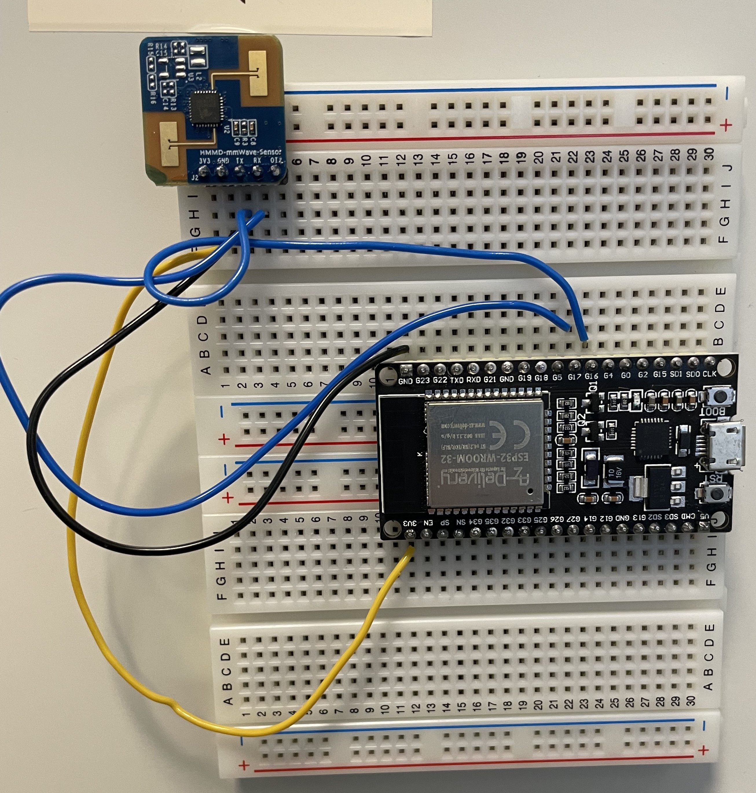

# Radar Module

## Overview

This module is intended for running and gathering data from the radar which should then be used for preprocessing which will be used for the ML.

## Hardware Requirements

- **Microcontroller**: AZ-Delivery ESP32-WROOM-32
- **Radar Sensor**: HMMD mmWave Sensor
- **Additional Components**: Usb to micro-usb cable for connecting computer to arduino, dupont cables, breadboards (recommended for easier mounting, but not required)

## Software Requirements

- Arduino IDE
- Python 3.11.9
  - Dependencies: View [requirements.txt](requirements.txt), for easy installation refer to [Python Environment](#python-environment)

## Installation

### Arduino Setup
1. Install Arduino IDE
2. Install required libraries and board managers:
   - Arduino ESP32 Boards
3. Configure board settings:
   - Board: ESP32 Dev Module
   - Port: Refer to [Finding the COM Port](#finding-the-com-port)
   - Baud Rate: 115200

### Python Environment

#### Windows

```bash
#Navigate to the Radar directory
cd Radar

#Create virtual environment
python -m venv venv

#Activate virtual environment
venv\Scripts\activate

#Install dependencies
pip install -r requirements.txt
```

#### macOS/Linux

```bash
#Navigate to the Radar directory
cd Radar

#Create virtual environment
python3 -m venv venv

#Activate virtual environment
source venv/bin/activate

#Install dependencies
pip install -r requirements.txt
```

#### Deactivating Virtual Environment

```bash
#When done, deactivate the virtual environment
deactivate
```

## Finding the COM Port

### Windows

1. **Using Device Manager**:
   - Right-click Start menu → Device Manager
   - Expand "Ports (COM & LPT)"
   - Look for "USB Serial Device" or "CH340" (or similar)
   - Note the COM port number (e.g., COM5, COM3)

2. **Using PowerShell**:
   ```powershell
   Get-WmiObject Win32_SerialPort | Select-Object Name, Description
   ```

3. **Using Arduino IDE**:
   - Tools → Port
   - Available COM ports are listed

### macOS

1. **Using Terminal**:
   ```bash
   ls /dev/tty.* | grep -i usb
   ```
   or
   ```bash
   ls /dev/cu.* | grep -i usb
   ```
   Look for `/dev/tty.usbserial-*` or `/dev/cu.usbserial-*`

2. **Using Arduino IDE**:
   - Arduino → Settings → Preferences
   - Tools → Port
   - Available ports are listed

### Linux

Note that Linux often requires special permissions for usage of

1. **Using Terminal**:
   ```bash
   ls /dev/ttyUSB* /dev/ttyACM*
   ```
   or
   ```bash
   dmesg | tail
   ```
   to see recent device connections

2. **Using Arduino IDE**:
   - File → Preferences
   - Tools → Port
   - Available ports are listed

## Hardware Connection

1. Connect radar sensor to microcontroller:
   - **Connections**: 
   1. Radar 3V3 - Arduino 3V3
   2. Radar GND - Arduino GND
   3. Radar TX - Arduino RX2_Pin (GPIO 16)
   4. Radar RX - Arduino TX2_Pin (GPIO 17). 
- In case of use of different GPIO pins, change RX2_Pin and TX2_Pin in [esp32Radar.ino](esp32Radar.ino)



2. Connect USB cable to upload code

3. Note the COM/device port [Finding the COM Port](#finding-the-com-port), change the port in the Arduino IDE, and in: [radarLogger.py](radarLogger.py),    [sendTime.py](sendTime.py), [run.py](run.py)

## Usage

### Uploading Code to Arduino

1. Open `esp32Radar.ino` in Arduino IDE
2. Select the correct board and COM port
3. Click Upload
4. Make sure serial monitor is closed

### Gathering background data
- Run the scripts in the room you're planning on using without any, or as little, furniture as possible (see [Running the Python Scripts for instructions](#running-the-python-scripts))

### Running the Python Scripts

- Remember to change the COM port in the different scripts, [run.py](run.py), [sendTime.py](sendTime.py), [radarLogger.py](radarLogger.py)

- [run.py](run.py): This script attempts to upload the code to the arduino again, then updates the arduino time and lastly reads and saves the radar output into a csv file.
  ```bash
  python run.py
  ```

## Troubleshooting

- **Issue**: Esp32 resets, ex. “Failed to connect to ESP32: Timed out waiting for packet header”
  - Solution: Upload the sketch to the esp32 through Arduino IDE, and run python scripts again.

## Output/Data Format

1. The output is saved into autonamed CSV files based on the date and time, and saved into the data folder.

2. Raw radar data format (captured by `radarLogger.py`):
   - Timestamp: YYYY-MM-DD HH:MM:SS.mmm
   - Range-Doppler map: 20×16 (320 values per frame)
